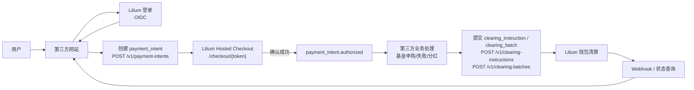
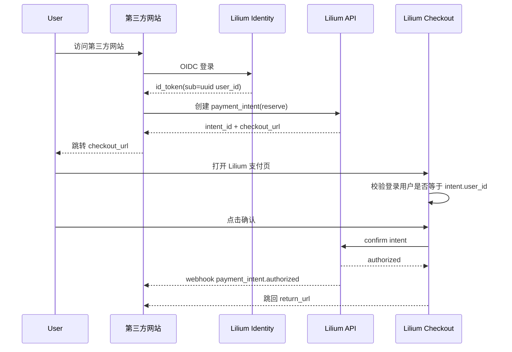
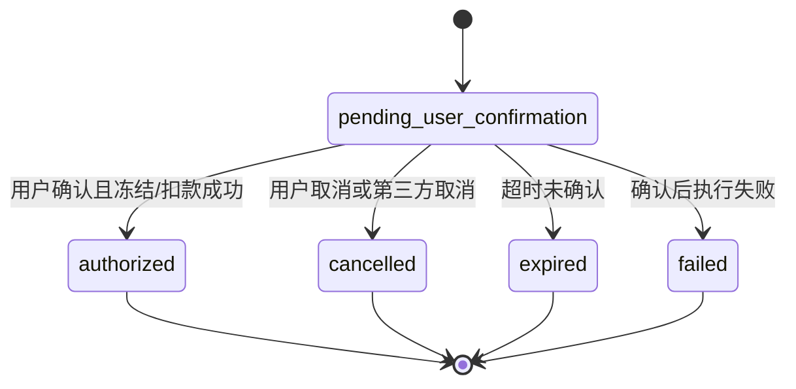
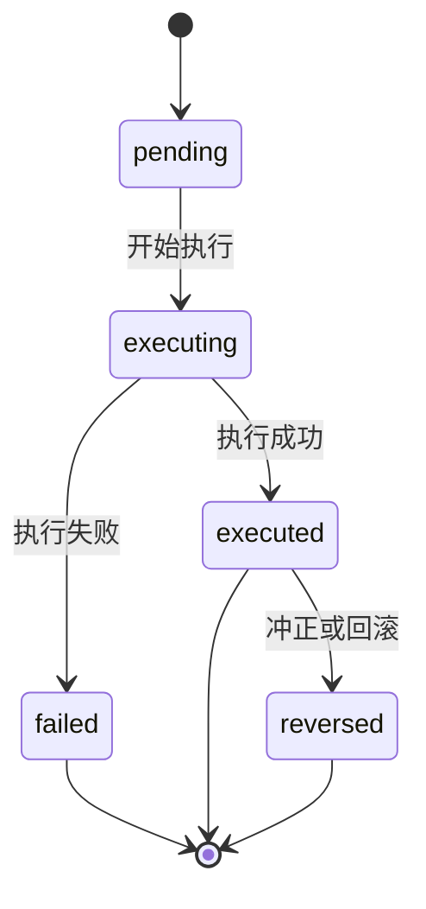
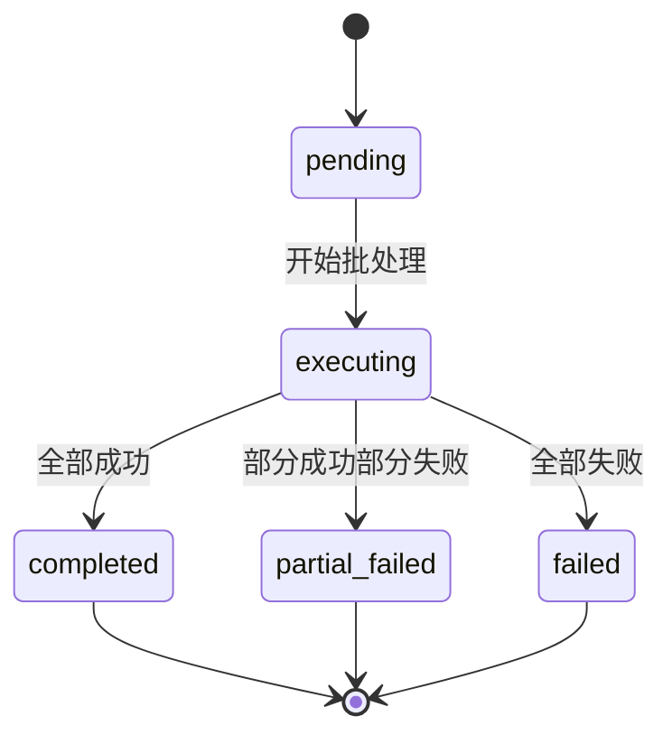

# Lilium 开放清算 API 接入规范 v1

适用对象：接入 Lilium 的第三方开发者  
文档状态：设计草案

## 1. 文档概述

Lilium 提供一套通用的游戏币清算能力，供第三方业务系统接入。第三方可以使用 Lilium 的用户身份体系识别用户，创建支付意图，引导用户跳转到 Lilium 完成确认，并在业务结果明确后提交后续清算指令。

本规范仅适用于游戏币场景，不涉及真实货币、银行卡、银行清算网络或任何受监管金融支付体系。

典型适用场景：

- 基金申购
- 基金赎回到账
- 分红发放
- 保险资金池赔付
- 交易市场、拍卖或撮合清算

Lilium v1 的核心设计原则：

- 用户身份由 Lilium 提供
- 所有用户相关调用都直接使用 Lilium `user_id`
- 需要用户授权的动作必须在 Lilium 页面完成确认
- 第三方负责业务规则和金额计算
- Lilium 负责余额清算、状态管理和审计留痕
- Lilium 只提供 OpenAPI 契约，不提供官方 SDK

## 2. 设计目标

- 让第三方系统复用 Lilium 用户身份
- 不要求第三方维护自己的用户认证数据库
- 提供标准化的跳转式支付确认体验
- 对外暴露一套可复用的通用清算模型，而不是基金专属接口
- 通过标准协议和 OpenAPI 降低接入成本

## 3. 非目标

- Lilium 不计算基金净值、份额、收益、亏损或持仓
- Lilium v1 不提供官方 SDK
- Lilium 不暴露内部钱包表结构或内部服务接口
- Lilium 不允许第三方绕过 Lilium 页面直接对用户做扣款或冻结

## 4. 协议选型

Lilium v1 采用以下协议组合：

- 用户登录：`OIDC Authorization Code + PKCE`
- 服务端接口鉴权：`OAuth 2.0 Client Credentials`
- 用户支付确认：`Hosted Checkout`
- 异步通知：`Webhook`
- 接口描述：`OpenAPI 3.x`

选择理由：

- `OIDC` 在各主流语言和框架中都有成熟实现
- `OAuth2 client_credentials` 适合第三方服务端调用 API
- Hosted Checkout 能确保用户授权始终发生在 Lilium 控制的页面内
- OpenAPI 能在没有官方 SDK 的前提下降低接入和调试成本

### 4.1 对外接入域名

Lilium v1 对外使用两个域名：

- API 域名：`https://api.lilium.kuma.homes`
- 登录与 Checkout 域名：`https://lilium.kuma.homes`

建议的对外路径规划：

- `https://lilium.kuma.homes/oauth/authorize`
- `https://api.lilium.kuma.homes/oauth/token`
- `https://lilium.kuma.homes/.well-known/openid-configuration`
- `https://lilium.kuma.homes/.well-known/jwks.json`
- `https://api.lilium.kuma.homes/v1/payment-intents`
- `https://api.lilium.kuma.homes/v1/clearing-instructions`
- `https://api.lilium.kuma.homes/v1/clearing-batches`
- `https://lilium.kuma.homes/checkout/{checkout_token}`
- `https://api.lilium.kuma.homes/openapi.json`

这样设计的好处：

- 第三方可以把服务端 API 与浏览器跳转入口分开配置
- 用户能清晰识别所有登录和支付确认都发生在 Lilium 官方页面
- API、登录和 Checkout 的安全策略可以独立控制

## 5. 角色与职责

### 5.1 Lilium 负责

- 用户身份认证
- 第三方后台鉴权
- 托管支付确认页
- 执行游戏币冻结、提交、解冻、发放、扣减
- 维护可审计的清算记录
- 提供状态查询和 Webhook 通知

### 5.2 第三方负责

- 业务产品本身
- 金额计算
- 申购是否成功等业务结果判断
- 自己的订单状态和业务流水
- 在业务处理完成后调用 Lilium 后续清算接口

### 5.3 边界

`user_id` 是业务标识，不是直接授权凭证。

任何会冻结或扣减用户余额的动作，都必须由用户在 Lilium 托管页面中明确确认。

## 6. 集成模型

接入分为两条链路：

1. 浏览器侧的用户登录链路
2. 服务端的清算 API 调用链路

### 6.1 浏览器侧登录链路

第三方网站使用 Lilium 的 OIDC 登录。登录完成后，第三方拿到的 ID Token 中，`sub` 即为 Lilium `user_id`。

### 6.2 服务端清算链路

第三方服务端通过 `client_credentials` 从 Lilium 获取访问令牌，再用该令牌调用清算相关 API。

### 6.3 Hosted Checkout

当某个业务动作需要用户确认时，第三方服务端先创建 `payment_intent`。Lilium 返回一个 `checkout_url`。第三方将用户跳转到该地址。Lilium 会在必要时要求用户登录，并在用户确认后执行对应的钱包清算动作。

### 6.4 总体流程图



## 7. 核心概念

### 7.1 `user_id`

Lilium 全局用户标识。第三方应将其作为稳定外键保存，用于后续所有用户相关调用。

字段约束：

- 类型：字符串
- 格式：UUID
- 长度：固定 36 字符
- 示例：`550e8400-e29b-41d4-a716-446655440000`

### 7.2 `partner`

第三方接入方。每个接入方会获得：

- `client_id`
- `client_secret`
- 可用 `scope`
- Webhook 配置
- 可访问的 `clearing_account` 权限

### 7.3 `clearing_account`

Lilium 管理的清算对手账户。第三方不会直接操作钱包，只能指定目标清算账户。

示例：

- `fund.alpha`
- `fund.beta`
- `insurance.pool`
- `market.spot`

### 7.4 `payment_intent`

需要用户确认的一笔支付意图。适用于冻结、扣费等用户授权场景。

### 7.5 `clearing_instruction`

一笔后台清算指令。适用于已获得授权后继续处理，或无需再次用户确认的发放类动作。

### 7.6 第三方接入配置模型

对于每个第三方机构，Lilium 至少需要维护两类配置：

1. 接口凭证
2. 清算账户

这两者职责不同，不能混用。

#### 接口凭证

接口凭证用于“谁可以调用 API”。

建议最小字段：

- `partner_id`
- `partner_name`
- `client_id`
- `client_secret_hash`
- `status`
- `allowed_scopes`
- `webhook_url`
- `webhook_secret`

用途：

- 通过 `OAuth 2.0 client_credentials` 获取访问令牌
- 标识当前 API 调用来自哪家机构
- 控制该机构可访问的接口范围
- 用于 Webhook 签名和验签

#### 清算账户

清算账户用于“钱最终记到哪里”。

建议最小字段：

- `account_code`
- `partner_id`
- `display_name`
- `wallet_user_id`
- `asset_code`
- `status`

示例：

- `fund.alpha`
- `fund.beta`
- `fund.dividend_pool`

用途：

- 用户冻结后，资金提交到哪个机构账户
- 分红、赎回等发放时，从哪个机构账户出款
- 对账时区分不同机构、不同产品或不同资金池

#### 推荐关系

推荐关系模型如下：

- 一个 `partner` 对应一个机构
- 一个 `partner` 可以配置一个或多个 `client`
- 一个 `partner` 可以配置一个或多个 `clearing_account`

最小可用配置通常是：

- 1 个 `partner`
- 1 个 `client_id/client_secret`
- 1 个主清算账户

如果同一家机构后续需要区分申购资金池、分红资金池、赎回资金池，可以继续在同一个 `partner` 下增加多个 `clearing_account`。

## 8. 支持的通用操作

Lilium v1 支持以下操作类型：

| 操作 | 是否需要用户确认 | 说明 |
| --- | --- | --- |
| `reserve` | 是 | 冻结用户余额 |
| `commit` | 否 | 将已冻结金额提交到清算账户 |
| `release` | 否 | 将已冻结金额退回用户 |
| `payout` | 否 | 从清算账户向用户发放余额 |
| `charge` | 是 | 从用户扣减余额到清算账户 |

对于基金系统，推荐只使用：

- `reserve`
- `commit`
- `release`
- `payout`

对应含义：

- 发起申购：`reserve`
- 申购成功：`commit`
- 申购失败：`release`
- 分红或赎回到账：`payout`

### 8.1 `asset_code`

为保证 OpenAPI 结构稳定，所有请求和响应仍然保留 `asset_code` 字段。

但在 Lilium v1 中，`asset_code` 当前只有一个合法取值：

- `dollors`

这意味着：

- 所有 `payment_intent` 请求中的 `asset_code` 必须传 `dollors`
- 所有 `clearing_instruction` 请求中的 `asset_code` 必须传 `dollors`
- 所有 `clearing_account` 的 `asset_code` 也应固定为 `dollors`

未来如果资产种类增加，Lilium 会通过版本化或文档更新扩展允许值。

### 8.2 `payment_intents.operation`

`payment_intents.operation` 的合法取值只有：

- `reserve`
- `charge`

不支持的取值包括但不限于：

- `commit`
- `release`
- `payout`

原因：

- `payment_intent` 的职责是承载“需要用户确认”的动作
- `reserve` 和 `charge` 都要求用户在 Hosted Checkout 中逐笔确认

### 8.3 `clearing_instructions.operation`

`clearing_instructions.operation` 的合法取值只有：

- `commit`
- `release`
- `payout`

不支持的取值包括但不限于：

- `reserve`
- `charge`

原因：

- `clearing_instruction` 的职责是承载“后台清算动作”
- 这类动作不应再次要求用户确认
- `reserve` 和 `charge` 都必须先通过 `payment_intent` 完成用户授权

### 8.4 `clearing_batches.operation`

`clearing_batches.operation` 的合法取值只有：

- `commit`
- `release`
- `payout`

不支持的取值包括但不限于：

- `reserve`
- `charge`

原因：

- 批量接口只适用于无需再次用户确认的后台处理
- `reserve` 和 `charge` 都要求用户逐笔在 Hosted Checkout 中确认，因此不能批量执行

## 9. 用户登录

### 9.1 OIDC 登录流程

第三方应接入 Lilium 提供的 OIDC 端点，包括：

- authorization endpoint
- token endpoint
- userinfo endpoint
- discovery document
- JWKS endpoint

第三方应将 ID Token 中的 `sub` 视为 Lilium `user_id`。`sub` 的格式同样是 UUID 字符串。

### 9.2 为什么推荐 OIDC

- 第三方不需要保存用户密码
- 第三方不需要访问 Lilium 认证数据库
- 各种主流 Web 框架都有成熟 OIDC 实现
- 用户身份始终由 Lilium 控制和定义

### 9.3 最小用户信息字段

- `sub`
- `preferred_username`
- `display_name`
- `avatar_url`

## 10. 服务端鉴权

第三方服务端调用 Lilium API 时，使用 `OAuth 2.0 Client Credentials`。

### 10.1 获取访问令牌

`POST /oauth/token`

示例请求体：

```text
grant_type=client_credentials
client_id=...
client_secret=...
scope=payment_intents.write clearing.write payment_intents.read clearing.read
```

示例响应：

```json
{
  "access_token": "access_123",
  "token_type": "Bearer",
  "expires_in": 3600,
  "scope": "payment_intents.write clearing.write payment_intents.read clearing.read"
}
```

### 10.2 API 请求头

所有受保护的 API 调用都应携带：

```http
Authorization: Bearer <access_token>
Idempotency-Key: <uuid>
Content-Type: application/json
```

### 10.3 字段与长度约束

除非另有说明，所有字符串字段都应使用 UTF-8 编码，且不应包含前后空白。

| 字段 | 适用范围 | 类型 | 格式 / 长度约束 | 说明 |
| --- | --- | --- | --- | --- |
| `user_id` | 所有用户相关请求/响应 | string | UUID，固定 36 字符 | 例如 `550e8400-e29b-41d4-a716-446655440000` |
| `partner_id` | 第三方配置 | string | 1-64 字符 | 建议使用稳定的机构标识 |
| `account_code` | `payment_intent` / `clearing_instruction` / `clearing_batch` | string | 1-64 字符 | 例如 `fund.alpha` |
| `wallet_user_id` | 清算账户配置 | string | 1-128 字符 | Lilium 内部系统钱包标识 |
| `intent_id` | `payment_intent` 响应 | string | 1-64 字符 | 由 Lilium 生成，例如 `pi_...` |
| `instruction_id` | `clearing_instruction` 响应 | string | 1-64 字符 | 由 Lilium 生成，例如 `ci_...` |
| `batch_id` | `clearing_batch` 响应 | string | 1-64 字符 | 由 Lilium 生成，例如 `cb_...` |
| `partner_reference_id` | 单笔业务请求 | string | 1-128 字符 | 第三方业务侧唯一引用，建议幂等稳定 |
| `batch_reference_id` | 批量请求 | string | 1-128 字符 | 第三方批次引用 |
| `asset_code` | 所有清算相关请求/响应 | string | 固定值 `dollors` | v1 当前唯一合法取值 |
| `amount` | 所有金额字段 | string | 正数字符串，最多 18 位整数 + 2 位小数 | 例如 `1000.00` |
| `title` | `payment_intent` | string | 1-64 字符 | 用户在 Checkout 页看到的标题 |
| `summary` | `payment_intent` | string | 1-200 字符 | 用户在 Checkout 页看到的说明 |
| `note` | `clearing_instruction` / `clearing_batch.items[]` | string | 0-200 字符 | 可选说明 |
| `return_url` | `payment_intent` | string | HTTPS URL，最长 2048 字符 | 支付完成后跳回地址 |
| `cancel_url` | `payment_intent` | string | HTTPS URL，最长 2048 字符 | 用户取消后跳回地址 |
| `webhook_url` | partner 配置 | string | HTTPS URL，最长 2048 字符 | Webhook 接收地址 |
| `Idempotency-Key` | 所有写接口请求头 | string | 1-128 字符 | 建议使用 UUID |

补充规则：

- `amount` 必须大于 `0`
- `amount` 统一使用字符串传输，禁止使用 JSON number
- `title`、`summary`、`note` 不应包含 HTML 或脚本片段
- `return_url`、`cancel_url`、`webhook_url` 必须是 `https://` 地址
- `partner_reference_id` 在同一个 partner 的同一种业务动作下应保持唯一
- `batch_reference_id` 在同一个 partner 下应保持唯一

## 11. 主流程说明

### 11.1 申购冻结流程



### 11.2 申购成功流程

1. 用户完成 `reserve` 确认
2. Lilium 冻结用户余额
3. 第三方处理基金申购逻辑
4. 第三方调用 `commit`
5. Lilium 将冻结资金提交到指定清算账户

### 11.3 申购失败流程

1. 用户完成 `reserve` 确认
2. Lilium 冻结用户余额
3. 第三方判定申购失败
4. 第三方调用 `release`
5. Lilium 将已冻结金额退回用户

### 11.4 赎回或分红发放流程

1. 第三方计算应发放金额
2. 第三方调用 `payout`
3. Lilium 从对应清算账户向用户发放余额

## 12. 资源模型

### 12.1 `payment_intent`

表示一笔需要用户确认的支付意图。

关键字段：

- `intent_id`
- `user_id`
- `operation`
- `account_code`
- `amount`
- `asset_code`
- `title`
- `summary`
- `partner_reference_id`
- `status`
- `checkout_url`
- `return_url`
- `cancel_url`
- `expires_at`

### 12.2 `clearing_instruction`

表示一笔后台清算动作。

关键字段：

- `instruction_id`
- `intent_id`
- `user_id`
- `operation`
- `account_code`
- `amount`
- `asset_code`
- `partner_reference_id`
- `status`
- `executed_at`
- `error_code`
- `error_message`

### 12.3 `clearing_batch`

表示一批后台清算动作的提交与执行结果汇总。

关键字段：

- `batch_id`
- `operation`
- `account_code`
- `asset_code`
- `status`
- `item_count`
- `success_count`
- `failed_count`
- `created_at`
- `completed_at`
- `items`

## 13. Payment Intent API

### 13.1 创建支付意图

`POST /v1/payment-intents`

`operation` 取值范围：

- `reserve`
- `charge`

请求示例：

```json
{
  "user_id": "550e8400-e29b-41d4-a716-446655440000",
  "operation": "reserve",
  "account_code": "fund.alpha",
  "amount": "1000.00",
  "asset_code": "dollors",
  "title": "Alpha 基金申购",
  "summary": "冻结 1000.00 dollors 用于 Alpha 基金申购",
  "partner_reference_id": "sub_20260409_001",
  "return_url": "https://partner.example.com/pay/return",
  "cancel_url": "https://partner.example.com/pay/cancel",
  "expires_in_seconds": 900
}
```

响应示例：

```json
{
  "intent_id": "pi_001",
  "status": "pending_user_confirmation",
  "checkout_url": "https://lilium.kuma.homes/checkout/ck_abc123",
  "expires_at": "2026-04-09T12:00:00Z"
}
```

### 13.2 查询支付意图

`GET /v1/payment-intents/{intent_id}`

响应示例：

```json
{
  "intent_id": "pi_001",
  "status": "authorized",
  "user_id": "550e8400-e29b-41d4-a716-446655440000",
  "operation": "reserve",
  "account_code": "fund.alpha",
  "amount": "1000.00",
  "asset_code": "dollors",
  "partner_reference_id": "sub_20260409_001",
  "authorized_at": "2026-04-09T12:01:02Z"
}
```

### 13.3 取消支付意图

`POST /v1/payment-intents/{intent_id}/cancel`

仅允许在等待用户确认阶段取消。

## 14. Clearing Instruction API

### 14.1 创建清算指令

`POST /v1/clearing-instructions`

`operation` 取值范围：

- `commit`
- `release`
- `payout`

申购成功示例：

```json
{
  "operation": "commit",
  "intent_id": "pi_001",
  "user_id": "550e8400-e29b-41d4-a716-446655440000",
  "account_code": "fund.alpha",
  "amount": "1000.00",
  "asset_code": "dollors",
  "partner_reference_id": "sub_20260409_001",
  "note": "申购成功"
}
```

申购失败示例：

```json
{
  "operation": "release",
  "intent_id": "pi_001",
  "user_id": "550e8400-e29b-41d4-a716-446655440000",
  "account_code": "fund.alpha",
  "amount": "1000.00",
  "asset_code": "dollors",
  "partner_reference_id": "sub_20260409_001",
  "note": "申购失败退回"
}
```

分红发放示例：

```json
{
  "operation": "payout",
  "user_id": "550e8400-e29b-41d4-a716-446655440000",
  "account_code": "fund.alpha",
  "amount": "85.25",
  "asset_code": "dollors",
  "partner_reference_id": "dividend_20260409_001",
  "note": "分红发放"
}
```

响应示例：

```json
{
  "instruction_id": "ci_001",
  "status": "executed",
  "operation": "payout",
  "user_id": "550e8400-e29b-41d4-a716-446655440000",
  "amount": "85.25",
  "executed_at": "2026-04-09T12:10:00Z"
}
```

### 14.2 查询清算指令

`GET /v1/clearing-instructions/{instruction_id}`

### 14.3 创建批量清算任务

`POST /v1/clearing-batches`

批量清算仅适用于无需再次用户确认的后台动作。

`operation` 取值范围：

- `commit`
- `release`
- `payout`

Lilium v1 不支持对以下动作使用批量接口：

- `reserve`
- `charge`

原因是 `reserve` 和 `charge` 都要求用户逐笔在 Hosted Checkout 中确认。

请求示例：

```json
{
  "operation": "payout",
  "account_code": "fund.alpha",
  "asset_code": "dollors",
  "batch_reference_id": "dividend_batch_20260409_001",
  "items": [
    {
      "user_id": "550e8400-e29b-41d4-a716-446655440000",
      "amount": "85.25",
      "partner_reference_id": "dividend_20260409_001",
      "note": "分红发放"
    },
    {
      "user_id": "6ba7b810-9dad-11d1-80b4-00c04fd430c8",
      "amount": "120.00",
      "partner_reference_id": "dividend_20260409_002",
      "note": "分红发放"
    }
  ]
}
```

响应示例：

```json
{
  "batch_id": "cb_001",
  "status": "pending",
  "operation": "payout",
  "account_code": "fund.alpha",
  "asset_code": "dollors",
  "item_count": 2,
  "success_count": 0,
  "failed_count": 0,
  "created_at": "2026-04-09T12:15:00Z"
}
```

### 14.4 查询批量清算任务

`GET /v1/clearing-batches/{batch_id}`

响应中应至少包含：

- 批次状态
- 总条数
- 成功条数
- 失败条数
- 失败项的错误码与错误信息

## 15. Hosted Checkout 行为规范

Hosted Checkout 是唯一允许终端用户对 `reserve` 和 `charge` 做授权确认的页面。

Checkout 页面行为：

- 若用户未登录 Lilium，则先要求登录
- 若当前登录用户与 `intent.user_id` 不一致，则支付失败
- 页面展示标题、金额、清算账户、说明文案
- 用户只需点击一次确认
- 确认完成后，Lilium 跳转回第三方提供的 `return_url`

浏览器跳转结果不是最终真相。第三方必须通过以下任一方式确认最终状态：

- 接收 Webhook
- 查询 `GET /v1/payment-intents/{intent_id}`
- 查询 `GET /v1/clearing-instructions/{instruction_id}`

## 16. 状态模型

### 16.1 `payment_intent` 状态

- `pending_user_confirmation`
- `authorized`
- `cancelled`
- `expired`
- `failed`

状态机：



### 16.2 `clearing_instruction` 状态

- `pending`
- `executing`
- `executed`
- `failed`
- `reversed`

状态机：



### 16.3 `clearing_batch` 状态

- `pending`
- `executing`
- `completed`
- `partial_failed`
- `failed`

状态机：



## 17. Webhook

Lilium 会在关键状态变化时向第三方发送 Webhook。

### 17.1 事件类型

- `payment_intent.created`
- `payment_intent.authorized`
- `payment_intent.cancelled`
- `payment_intent.expired`
- `payment_intent.failed`
- `clearing_instruction.executed`
- `clearing_instruction.failed`
- `clearing_instruction.reversed`

### 17.2 请求头

- `X-Lilium-Event-Id`
- `X-Lilium-Timestamp`
- `X-Lilium-Signature`

### 17.3 签名规则

Lilium 使用第三方的 `webhook_secret` 对以下内容做 `HMAC-SHA256`：

```text
{timestamp}.{raw_body}
```

### 17.4 投递语义

- 非 `2xx` 响应会被视为失败
- Lilium 会对失败投递进行重试
- 第三方必须保证 Webhook 处理逻辑幂等

## 18. OpenAPI 契约

Lilium 会提供完整的 OpenAPI 定义文档，作为对外接口契约。

OpenAPI 是第三方集成时的主要参考来源。第三方可以基于该文档：

- 使用自己的工具生成客户端代码
- 做请求和响应结构校验
- 构建自动化测试
- 对接错误码和状态模型

Lilium v1 不承诺提供或维护官方 SDK。

## 19. 错误模型

错误响应统一格式：

```json
{
  "error": {
    "code": "INSUFFICIENT_FUNDS",
    "message": "wallet balance insufficient",
    "retryable": false
  },
  "request_id": "req_001"
}
```

常见错误码：

- `UNAUTHORIZED_PARTNER`
- `INVALID_SCOPE`
- `INVALID_USER_ID`
- `INVALID_ACCOUNT_CODE`
- `INVALID_OPERATION`
- `INTENT_NOT_CONFIRMABLE`
- `INTENT_EXPIRED`
- `INSUFFICIENT_FUNDS`
- `INSUFFICIENT_ESCROW`
- `IDEMPOTENCY_CONFLICT`
- `WEBHOOK_SIGNATURE_INVALID`

## 20. 幂等要求

所有写接口都必须带 `Idempotency-Key`。

适用接口：

- `POST /v1/payment-intents`
- `POST /v1/payment-intents/{intent_id}/cancel`
- `POST /v1/clearing-instructions`
- `POST /v1/clearing-batches`

推荐做法：

- 每个业务动作生成稳定的幂等键
- 持久化保存 `partner_reference_id` 与 `idempotency_key` 的关系
- 网络失败时允许安全重试

## 21. 安全要求

第三方必须满足以下要求：

- 所有 API 调用都使用 HTTPS
- 妥善保护 `client_secret`
- 不在浏览器中暴露服务端凭据
- 对所有 Webhook 做签名校验
- 不把 `user_id` 当作直接授权凭证
- 不绕过 Hosted Checkout 直接对用户做冻结或扣款

## 22. 最小接入清单

- 完成 OIDC 登录接入
- 持久化保存 Lilium `user_id`
- 完成 `client_credentials` 令牌获取
- 实现创建 `payment_intent`
- 完成跳转 Hosted Checkout
- 接收并处理 Webhook
- 在业务完成后调用 `commit`、`release`、`payout` 或批量清算 API
- 为所有写接口实现幂等
- 为所有业务订单保存 `partner_reference_id`

## 23. 基金系统 MVP 建议范围

对于基金类产品，Lilium 建议第一阶段只接：

- OIDC 登录
- `reserve`
- `commit`
- `release`
- `payout`
- 批量 `payout`
- Webhook

这一范围已足以支持：

- 基金申购
- 申购失败退回
- 基金赎回到账
- 基金分红发放
- 批量分红发放

## 24. 总结

Lilium 开放清算 API v1 的最小心智模型如下：

- 用 Lilium 登录识别用户
- 使用 Lilium `user_id` 作为统一用户标识
- 需要用户确认时创建 `payment_intent`
- 将用户跳转到 Lilium Hosted Checkout
- 根据业务结果调用后台清算指令
- 以 OpenAPI 文档作为主要集成契约

对于大多数第三方，实际接入步骤只有六步：

1. 接入 Lilium 登录
2. 获取并保存 Lilium `user_id`
3. 创建 `payment_intent`
4. 跳转 `checkout_url`
5. 处理 Webhook
6. 在业务结果明确后调用 `commit`、`release`、`payout` 或批量清算 API
